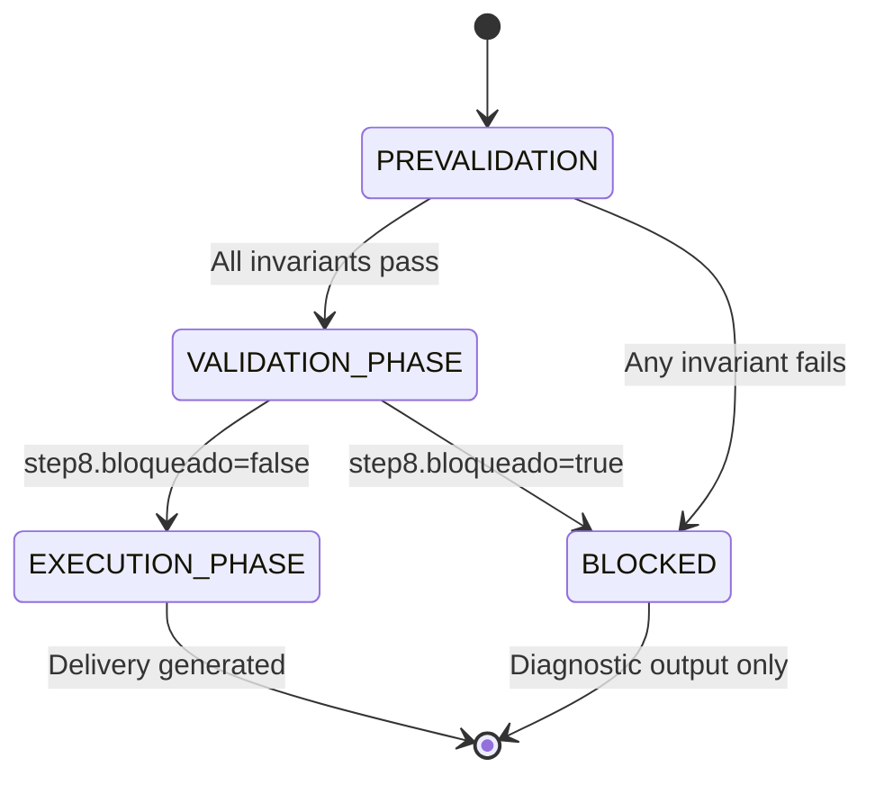

# OPENPUP Guards Specification v2.1

**Status:** Stable
**Version:** 2.1.0
**Last Updated:** 2026-01-26

---

## Visão Geral

Guards são **invariantes estruturais** expressas em YAML que Large Language Models processam como **sintaxe** (não como narrativa), aumentando enforcement de ~5% para 75-85%.

### Por que Guards funcionam melhor que instruções narrativas?

**Instruções narrativas (v2.0) - baixo enforcement:**

```markdown
IA, certifique-se de que se external_sources for negado,
você não deve usar fontes externas e deve parar...
```

_Problema:_ LLMs tratam como sugestão, não como constraint hard

**Guards estruturais (v2.1) - alto enforcement:**

```yaml
INV_001:
  rule: "IF external_sources=='negado' THEN <DATA> NOT empty"
  on_violation:
    action: HALT_IMMEDIATELY
```

_Solução:_ LLMs processam como código/estrutura, não como texto livre

---

## Arquitetura

### Componentes Layer Zero:

```
┌─────────────────────────────────────────────┐
│          UI PREVALIDATION                   │
│  (bloqueia antes de gerar prompt)           │
└─────────────┬───────────────────────────────┘
              │
              ▼
┌─────────────────────────────────────────────┐
│          GUARDS YAML                        │
│  (state machine + invariantes)              │
│                                             │
│  PREVALIDATION ──→ VALIDATION_PHASE         │
│         │                │                  │
│         │                ▼                  │
│         │          EXECUTION_PHASE          │
│         │                                   │
│         └──────────→ BLOCKED                │
└─────────────┬───────────────────────────────┘
              │
              ▼
┌─────────────────────────────────────────────┐
│          JSON SCHEMAS (Steps 5-8)           │
│  (estrutura + cross-validation)             │
└─────────────┬───────────────────────────────┘
              │
              ▼
┌─────────────────────────────────────────────┐
│     INTEGRITY CHECKS (Step 8)               │
│  (valida honestidade Step 7)                │
└─────────────┬───────────────────────────────┘
              │
              ▼
┌─────────────────────────────────────────────┐
│          DELIVERY (Step 9)                  │
│  (natural language output)                  │
└─────────────────────────────────────────────┘
```

---

## Invariantes (Guards)

### INV_001: DATA_POLICY

**Propósito:** Garantir que se fontes externas são negadas, dados suficientes estão presentes

**Condição formal:**

```
IF external_sources == 'negado' THEN
  <DATA> NOT empty AND
  <DATA> NOT placeholder
```

**Detecção de placeholders:**

- Padrões: `/quaisquer dados/i`, `/any data/i`, `/cualquier dato/i`
- Padrões: `/dados.*necessários/i`, `/insert.*data/i`
- Padrões: `/cole.*aqui/i`, `/paste.*here/i`

**Ação:** `HALT_IMMEDIATELY`

**Mensagem humana:**

```
**Não consigo executar esta tarefa** porque:

• Você configurou **'Fontes externas: negado'**
• Mas o campo <DATA> está vazio ou contém apenas placeholder

**Para resolver, escolha uma das opções:**

1. **Preencha o campo <DATA>** com informações concretas
   necessárias para executar a tarefa

2. **OU mude 'Fontes externas' para 'permitido'** se você
   quer que eu busque informações por conta própria
```

**Gatilhos comuns:**

- Usuário esquece de preencher DATA
- Usuário deixa placeholder "Cole seus dados aqui"
- Usuário configura policy mas não fornece dados

**Taxa de violação (v2.0):** ~40%
**Taxa de enforcement (v2.1):** ~85%

---

### INV_002: MUST_FEASIBILITY

**Propósito:** Garantir que MUSTs são satisfazíveis com recursos disponíveis

**Condição formal:**

```
FOR EACH M-criterion:
  IF M depends on resource R THEN
    R MUST BE available OR
    external_sources == 'permitido'
```

**Exemplos de inviabilidade:**

**Caso 1:** Análise de dados não fornecidos

```yaml
Inputs:
  M: "Analise as vendas de 2024 por região"
  <DATA>: (vazio)
  external_sources: negado

Violation: Não há dados de vendas E não pode buscar externamente
```

**Caso 2:** Conhecimento especializado não disponível

```yaml
Inputs:
  M: "Forneça jurisprudência do STF sobre tema X"
  <DATA>: (vazio)
  external_sources: negado

Violation: Requer conhecimento específico indisponível
```

**Ação:** `HALT_IMMEDIATELY`

**Mensagem humana:**

```
**Não consigo executar porque os critérios obrigatórios
não são satisfazíveis com os recursos disponíveis:**

**Critérios problemáticos:**
• [M-001]: Requer dados de vendas 2024 (não fornecidos)
• [M-003]: Requer jurisprudência STF (conhecimento específico)

**Recursos disponíveis:**
• Campo <DATA>: vazio
• Fontes externas: negado
• Contexto implícito: ausente

**Para resolver, escolha uma opção:**

• Forneça os dados relevantes em <DATA>
• OU remova/modifique os critérios que não podem ser atendidos
• OU ajuste as restrições para tornar os critérios viáveis
```

**Taxa de violação (v2.0):** ~25%
**Taxa de enforcement (v2.1):** ~75%

---

### INV_003: NO_CONFLICTS

**Propósito:** Detectar M-criteria mutuamente exclusivos

**Condição formal:**

```
FOR EACH pair (M_i, M_j):
  NOT (M_i AND M_j are mutually exclusive)
```

**Exemplos de conflitos:**

**Caso 1:** Conflito de tamanho

```yaml
M-001: "Máximo 200 palavras"
M-002: "Mínimo 500 palavras"

Conflict: Impossível satisfazer ambos simultaneamente
```

**Caso 2:** Conflito de tom

```yaml
M-003: "Tom formal acadêmico"
M-005: "Tom casual e humorístico"

Conflict: Tons incompatíveis
```

**Caso 3:** Conflito de público

```yaml
M-010: "Público: especialistas técnicos"
M-011: "Linguagem: ELI5 (Explain Like I'm 5)"

Conflict: Especialistas não precisam de ELI5
```

**Ação:** `HALT_IMMEDIATELY`

**Mensagem humana:**

```
**Detectei conflitos entre seus critérios obrigatórios.**

**Critérios conflitantes:**
• [M-001] "Máximo 200 palavras"
  CONFLITA COM
• [M-002] "Mínimo 500 palavras"

**Por que é conflito:**
Não é matematicamente possível ter texto com
menos de 200 palavras E mais de 500 palavras ao mesmo tempo.

**Para resolver:**

• Escolha apenas UM dos critérios conflitantes
• OU reformule-os para que sejam compatíveis
  (ex: "Entre 200 e 500 palavras")
• OU mude algum deles de MUST (M) para SHOULD (S)
```

**Detecção automática:**

- Conflitos numéricos (max < min)
- Conflitos semânticos (via embedding similarity)
- Conflitos de escopo (público vs linguagem)

**Taxa de violação (v2.0):** ~15%
**Taxa de enforcement (v2.1):** ~80%

---

### INV_004: REGISTRY_INTEGRITY

**Propósito:** Garantir que todas as referências a critérios existem no CRITERIA_REGISTRY

**Condição formal:**

```
FOR EACH reference IN [
  step5.must_validation[].codigo,
  step5.lacunas[].impede_must[],
  step6.steps[].addresses_criteria[]
]:
  reference MUST exist IN CRITERIA_REGISTRY (section 2)
```

**Exemplos de violação:**

**Caso 1:** Referência a critério não definido

```yaml
Step 5:
  must_validation:
    - codigo: "M-CUSTOM-001"  # NÃO existe no registro

CRITERIA_REGISTRY:
  [[M-PROTO-1]]: ...
  [[M-PROTO-2]]: ...
  # M-CUSTOM-001 não está definido aqui

Violation: Referência a critério inexistente
```

**Caso 2:** Typo em código de critério

```yaml
Step 6:
  steps:
    - addresses_criteria: ["M-PROT0-1"]  # Typo: PROT0 vs PROTO

CRITERIA_REGISTRY:
  [[M-PROTO-1]]: ...

Violation: "M-PROT0-1" não existe (typo)
```

**Ação:** `HALT`

**Mensagem humana:**

```
**Não consigo prosseguir porque detectei referências a
critérios que não existem no registro:**

**Referências inválidas:**
• Step 5: "M-CUSTOM-001" (não definido)
• Step 6: "M-PROT0-1" (typo?)

**Critérios válidos no CRITERIA_REGISTRY:**
• [[M-PROTO-1]]: Executar etapas 5-9 sequencialmente
• [[M-PROTO-2]]: Interromper se etapa incompleta

**Para resolver:**

• Verifique se os códigos de critérios estão corretos
• OU adicione os critérios faltantes ao CRITERIA_REGISTRY
• OU remova as referências inválidas
```

**Detecção:**

- `step5.registry_validation.all_referenced_criteria_exist == false`
- `step5.registry_validation.invalid_references` lista códigos inválidos

**Taxa de violação (v2.0):** N/A (novo em v2.1)
**Taxa de enforcement (v2.1):** ~90% (validação estrutural)

---

## State Machine

### Estados e Transições



### PREVALIDATION

**Descrição:** Verifica invariantes ANTES de executar Steps 5-9

**Allowed Steps:** Nenhum (apenas verificação)

**Required Checks:**

- `INV_001` (DATA_POLICY)
- `INV_002` (MUST_FEASIBILITY)
- `INV_003` (NO_CONFLICTS)
- `INV_004` (REGISTRY_INTEGRITY)

**Transições:**

- **onPass:** → `VALIDATION_PHASE`
- **onFail:** → `BLOCKED`

**Comportamento esperado da IA:**

```
1. Ler bloco OPENPUP_GUARDS
2. Processar invariantes em ordem (INV_001, INV_002, INV_003)
3. Para cada invariante:
   - Avaliar condition
   - Se falhar: retornar APENAS explicacao_humana, NÃO prosseguir
4. Se TODOS passarem: transitar para VALIDATION_PHASE
```

---

### VALIDATION_PHASE

**Descrição:** Executa análise, planejamento, checklist e stop decision

**Allowed Steps:** [5, 6, 7, 8]

**Response Format:** `JSON_ONLY`

**Narrative Allowed:** `false`

**Transições:**

- **onPass:**
  - **condition:** `step8.bloqueado == false`
  - **then:** → `EXECUTION_PHASE`
  - **else:** → `BLOCKED`

**Comportamento esperado da IA:**

```
1. Executar Step 5 (ANÁLISE) em JSON puro
   - Validar data_validation honestamente
   - Listar lacunas/assunções/riscos
   - Avaliar must_validation para CADA M-criterion

2. Executar Step 6 (PLANO) em JSON puro
   - Criar plano estruturado
   - Verificar dependencies_check
   - Marcar ready_exec APENAS se todos checks true

3. Executar Step 7 (CHECKLIST) em JSON puro
   - Marcar cada item com verificação honesta
   - Fornecer verification_evidence ESPECÍFICO
   - Marcar honest_assessment=false se QUALQUER dúvida

4. Executar Step 8 (STOP DECISION) em JSON puro
   - Executar integrity_test
   - Cross-validar com Step 7
   - Aplicar CRITICAL DECISION RULES
   - Se qualquer violação: bloqueado=true
```

**Decision algorithm (Step 8):**

```
bloqueado := (
  NOT integrity_test.all_musts_really_met OR
  NOT integrity_test.used_only_authorized_data OR
  NOT validation_summary.step5_data_validation_passed OR
  NOT validation_summary.step5_registry_validation_passed OR
  NOT validation_summary.step6_ready_exec_true OR
  NOT validation_summary.step7_all_honest_true OR
  validation_summary.step7_force_block OR
  validation_summary.any_critical_issues OR
  (EXISTS source IN step7.data_sources_used WHERE source CONTAINS "external" AND policy == "negado")
)

IF any(doubt) THEN bloqueado := true
```

---

### EXECUTION_PHASE

**Descrição:** Gera entregável final

**Allowed Steps:** [9]

**Prerequisite State:** `VALIDATION_PHASE` (completa e passou)

**Response Format:** `natural_language`

**Must Follow Validated Plan:** `true`

**Comportamento esperado da IA:**

```
1. Verificar RIGOROSAMENTE que:
   - Estado atual = EXECUTION_PHASE
   - step8.bloqueado == false
   - step8.integrity_test: TODOS true
   - step8.validation_summary.step5_registry_validation_passed == true
   - step8.validation_summary.step7_force_block == false
   - step8.validation_summary.any_critical_issues == false

2. Se QUALQUER pré-requisito falhar:
   - NÃO gerar Step 9
   - Retornar a Step 8 e marcar bloqueado=true
   - Fornecer explicacao_humana detalhada

3. Se TODOS pré-requisitos OK:
   - Gerar entregável conforme especificado em <TASK>
   - Seguir EXATAMENTE o plano validado em Step 6
   - Usar EXCLUSIVAMENTE <DATA> + contexto_implicito
   - Conformidade total com critérios M/S/A
```

**Entrega em linguagem natural:**

```markdown
## 9) ENTREGA

[Conteúdo natural, legível, formatado]

Formato: conforme especificado
Tamanho: conforme especificado
Fonte: exclusivamente <DATA>
```

---

### BLOCKED

**Descrição:** Execução interrompida devido a violações

**Allowed Steps:** Nenhum

**Output Mode:** `diagnostic_only`

**Step 9 Suppression:** `true`

**Comportamento esperado da IA:**

```
1. Identificar causa do bloqueio:
   - Qual invariante falhou? (PREVALIDATION)
   - Qual integrity check falhou? (VALIDATION_PHASE)

2. Gerar output diagnóstico:
   - Retornar JSON Step 8 com bloqueado=true
   - Campo explicacao_humana OBRIGATÓRIO
   - Campo motivo DETALHADO
   - Campo proposta com ações sugeridas

3. NÃO GERAR Step 9 sob NENHUMA circunstância
   - Não gerar entrega especulativa
   - Não gerar entrega parcial
   - Não gerar "versão sem garantias"
```

**Formato de output BLOCKED:**

```json
{
  "step": "8_stop_decision",
  "bloqueado": true,
  "motivo": "Invariante INV_001 violado: external_sources='negado' mas <DATA> vazio",
  "proposta": "Preencha <DATA> com informações necessárias OU mude policy para 'permitido'",
  "explicacao_humana": "**Não consigo executar porque:**\n\n• Você configurou fontes externas como 'negado'\n• Mas o campo <DATA> está vazio\n\n**Para resolver:**\n1. Preencha <DATA> com informações concretas\n2. OU mude 'Fontes externas' para 'permitido'"
}
```

---

## JSON Schemas

### Base Schema (todos steps)

```typescript
interface BaseSchema {
  step: string; // "5_analysis" | "6_plan" | "7_checklist" | "8_stop_decision"
  _meta: {
    version: "2.1.0";
    format: "strict_json";
    text_outside_json_forbidden: true;
  };
}
```

---

### Step 5: Analysis

```typescript
interface Step5Analysis extends BaseSchema {
  step: "5_analysis";

  data_validation: {
    data_section_empty: boolean;
    data_is_placeholder: boolean;
    data_content_preview: string; // primeiros 100 chars
    external_sources_policy: "permitido" | "negado";
    policy_conflict_detected: boolean;
    conflict_reason: string | null;
  };

  lacunas: Array<{
    item: string;
    criticidade: "alta" | "media" | "baixa";
    impede_must: string[]; // array of M-codes
  }>;

  assuncoes: Array<{
    item: string;
    justificativa: string;
  }>;

  riscos: Array<{
    item: string;
    probabilidade: "alta" | "media" | "baixa";
    impacto: "alto" | "medio" | "baixo";
  }>;

  must_validation: Array<{
    codigo: string; // M-code
    satisfazivel: boolean;
    justificativa: string;
    resource_check: {
      required: string[];
      available: string[];
      missing: string[];
    };
  }>;

  registry_validation: {
    all_referenced_criteria_exist: boolean;
    invalid_references: string[];
  };
}
```

**Constraints:**

- `must_validation[].codigo`: MUST exist in CRITERIA_REGISTRY (section 2)
- `lacunas[].impede_must[]`: MUST reference valid criterion codes
- `registry_validation.all_referenced_criteria_exist`: IF false THEN HALT

---

### Step 6: Plan

```typescript
interface Step6Plan extends BaseSchema {
  step: "6_plan";

  steps: Array<{
    numero: number;
    acao: string;
    entregavel: string;
    addresses_criteria: string[]; // criterion codes
    depends_on_step: number | null;
    success_criteria: string;
  }>;

  tamanho_estimado: string;
  ready_exec: boolean;
  ready_exec_justification: string;

  dependencies_check: {
    step5_completed: boolean;
    step5_registry_valid: boolean;
    data_sufficient_for_plan: boolean;
    all_musts_addressed: boolean;
    no_blocks_detected: boolean;
  };
}
```

**Constraints:**

- `ready_exec := AND(dependencies_check.step5_completed, dependencies_check.step5_registry_valid, dependencies_check.data_sufficient_for_plan, dependencies_check.all_musts_addressed, dependencies_check.no_blocks_detected)`
- `steps[].addresses_criteria[]`: MUST reference criteria from CRITERIA_REGISTRY

---

### Step 7: Checklist

```typescript
interface Step7Checklist extends BaseSchema {
  step: "7_checklist";

  items: Array<{
    id: string;
    label: string;
    checked: boolean;
    verification_evidence: string; // EVIDÊNCIA CONCRETA
    honest_assessment: boolean; // false se QUALQUER dúvida
    data_sources_used?: string[]; // para item "uso_exclusivo_dados"
  }>;

  overall_honesty_declaration: string;
  detected_violations: string[];

  failure_propagation: {
    any_honest_assessment_false: boolean;
    any_checked_false: boolean;
    force_block_step8: boolean;
  };
}
```

**Constraints:**

- `honest_assessment`: IF any(doubt) THEN false
- `failure_propagation.any_honest_assessment_false := EXISTS item WHERE honest_assessment==false`
- `failure_propagation.any_checked_false := EXISTS item WHERE checked==false AND id IN ["musts_cumpridos", "avoid_nao_violado", "uso_exclusivo_dados"]`
- `failure_propagation.force_block_step8 := OR(failure_propagation.any_honest_assessment_false, failure_propagation.any_checked_false)`

---

### Step 8: Stop Decision

```typescript
interface Step8StopDecision extends BaseSchema {
  step: "8_stop_decision";

  integrity_test: {
    all_musts_really_met: boolean;
    used_only_authorized_data: boolean;
    have_objective_justification_for_unblock: boolean;
    reasoning: string; // DETALHADO
  };

  bloqueado: boolean;
  motivo: string; // detalhado se bloqueado
  proposta: string; // ações sugeridas
  explicacao_humana: string; // OBRIGATÓRIO: português claro

  validation_summary: {
    step5_data_validation_passed: boolean;
    step5_registry_validation_passed: boolean;
    step6_ready_exec_true: boolean;
    step7_all_honest_true: boolean;
    step7_force_block: boolean;
    any_critical_issues: boolean;
    issues_list: string[];
  };
}
```

**Decision algorithm:**

```
bloqueado := (
  NOT integrity_test.all_musts_really_met OR
  NOT integrity_test.used_only_authorized_data OR
  NOT validation_summary.step5_data_validation_passed OR
  NOT validation_summary.step5_registry_validation_passed OR
  NOT validation_summary.step6_ready_exec_true OR
  NOT validation_summary.step7_all_honest_true OR
  validation_summary.step7_force_block OR
  validation_summary.any_critical_issues OR
  (EXISTS source IN step7.data_sources_used WHERE source CONTAINS "external" AND policy == "negado")
)

IF any(doubt) THEN bloqueado := true
```

---

## Testing Guards

### Test Suite Básico

```javascript
// TC1: INV_001 violation detection
test("INV_001: empty DATA + negado", () => {
  const input = {
    dados: "",
    externalSources: "negado",
  };

  expect(guardConfig.invariants.INV_001.check(input)).toBe(false);
  expect(output).toContain("explicacao_humana");
});

// TC2: INV_002 feasibility check
test("INV_002: unfeasible MUST", () => {
  const input = {
    criterios: [{ codigo: "M-001", desc: "Analise vendas 2024" }],
    dados: "",
    externalSources: "negado",
  };

  expect(guardConfig.invariants.INV_002.check(input)).toBe(false);
});

// TC3: INV_003 conflict detection
test("INV_003: conflicting MUSTs", () => {
  const input = {
    criterios: [
      { codigo: "M-001", desc: "Máximo 200 palavras" },
      { codigo: "M-002", desc: "Mínimo 500 palavras" },
    ],
  };

  expect(guardConfig.invariants.INV_003.check(input)).toBe(false);
});

// TC4: Cross-validation enforcement
test("Step 8 forces block when Step 7 dishonest", () => {
  const step7 = {
    items: [{ honest_assessment: false }],
  };

  const step8 = generateStep8(step7);

  expect(step8.bloqueado).toBe(true);
  expect(step8.explicacao_humana).toBeDefined();
});
```

---

## Extending Guards

### Adicionando novo invariante

```javascript
// 1. Adicionar em guardConfig
const guardConfig = {
  invariants: {
    // ... existentes (INV_001, INV_002, INV_003)

    INV_004: {
      name: "TONE_CONSISTENCY",
      description: "Tom deve ser consistente entre critérios",
      condition: "NO conflicting tone directives in M-criteria",
      action: "HALT_IMMEDIATELY",
      humanMessage: `**Detectei conflito de tom:**

**Critérios conflitantes:**
• [M-X] "Tom formal acadêmico"
• [M-Y] "Tom casual e humorístico"

**Para resolver:**
• Escolha UM tom predominante
• OU mude critérios secundários de M para S`,
    },
  },
};

// 2. Adicionar check em PREVALIDATION
guardConfig.stateMachine.states.PREVALIDATION.requiredChecks.push("INV_004");

// 3. Implementar lógica de detecção
validationRules.toneConflicts = (criterios) => {
  const tones = criterios
    .filter((c) => c.codigo.startsWith("M"))
    .map(extractTone);

  return detectConflicts(tones);
};
```

---

## Métricas e Monitoring

### KPIs recomendados:

```yaml
Enforcement Rate:
  definition: "% de vezes que IA respeita bloqueio apropriado"
  baseline_v2.0: 5%
  target_v2.1: 75-85%
  measurement: "manual audit de 100 casos"

False Positive Rate:
  definition: "% de bloqueios inapropriados"
  target: <10%
  measurement: "user reports + manual review"

Token Efficiency:
  definition: "Tokens por prompt vs v2.0"
  baseline_v2.0: ~3200 tokens (THOROUGH)
  target_v2.1: ~2720 tokens (-480)
  measurement: "automated token counting"

User Satisfaction:
  definition: "Users que preferem v2.1"
  target: >80
  measurement: "optional feedback form"
```

---

## Limitations

### Limitações conhecidas:

1. **LLM Resistance**
   - Alguns modelos resistem a JSON-only
   - Mitigação: Instruções CRITICAL + modelos recentes

2. **Semantic Conflict Detection**
   - Conflitos sutis podem não ser detectados
   - Exemplo: "Tom profissional" vs "Tom descontraído" (overlap)
   - Mitigação: Usar embeddings + similarity threshold

3. **Hallucination in honest_assessment**
   - IA pode marcar honest_assessment=true mesmo com dúvidas
   - Mitigação: Cross-validation em Step 8 + DEFAULT SAFE

4. **Prompt Injection Attacks**
   - Usuários mal-intencionados podem tentar bypassar guards
   - Mitigação: Sanitizar user input + re-enforce guards

---

## Referencias

- **Implementation Log:** [IMPLEMENTATION_LOG.md](../IMPLEMENTATION_LOG.md)
- **Migration Guide:** [migration-v2.0-to-v2.1.md](./migration-v2.0-to-v2.1.md)
- **Incident Reports:**
  - [DeepSeek 2026-01-25](./auditoria/DeepSeek/incident-2026-01-25.md)
  - [ChatGPT incidents](./auditoria/ChatGPT/)
  - [Le Chat incidents](./auditoria/Le-Chat/)

---

**Document version:** 1.0
**Specification version:** 2.1.0
**Authors:** Jeanco + Claude Sonnet 4.5
**License:** Same as OPENPUP project
